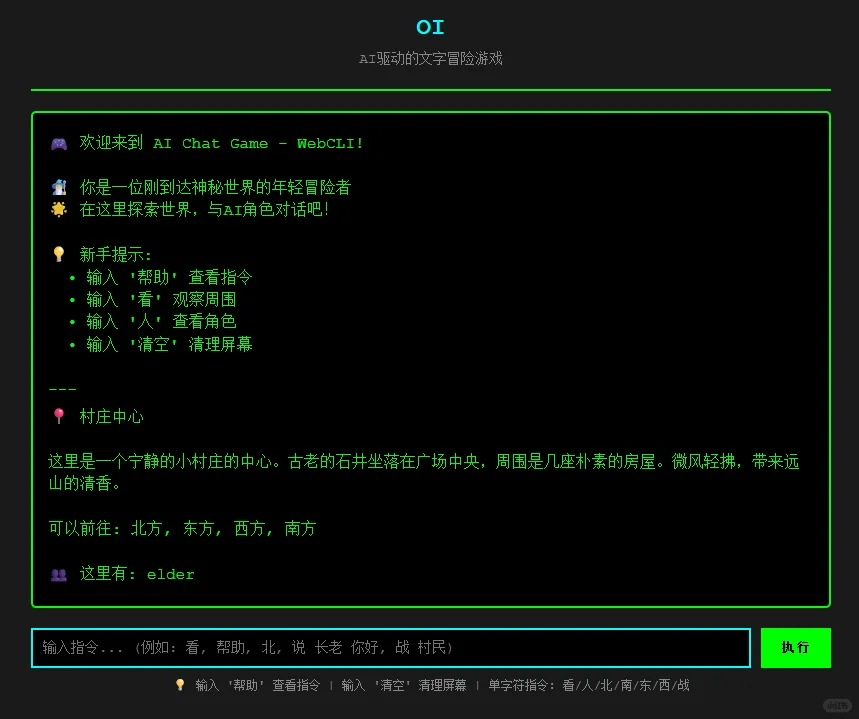

<p align="center">
  
</p>

# Oi !

一个基于 WebCLI 的 RPG 游戏，使用 Moonshot Kimi K2 作为聊天内容与剧情引擎。

## 功能简介
- 多角色互动与对话，角色性格、心情动态变化
- 丰富的剧情场景与探索（支持自定义剧情）
- 物品系统：获取、使用、赠送物品
- 回合制战斗系统
- Web CLI 交互界面，支持命令输入
- Kimi K2 驱动角色智能回复

## 在线体验
[0l.ink](https://0l.ink/)

<p align="center">
  
</p>

## 目录结构
```
├── config.py           # 配置加载与管理
├── config.yaml         # 游戏与AI配置文件
├── plot_manager.py     # 剧情管理
├── requirements.txt    # 依赖包列表
├── service_ai.py       # AI服务集成
├── service_character.py# 角色与战斗系统
├── service_game.py     # 游戏主逻辑
├── service_inventory.py# 物品栏与物品逻辑
├── service_world.py    # 世界与场景管理
├── webcli_app.py       # WebCLI主入口
├── start.bat           # Windows 启动脚本
├── start.sh            # Linux/Mac 启动脚本
├── plots/              # 剧情数据
├── worlds/             # 世界与角色数据
```

## 快速开始

### 1.创建虚拟环境
以Linux为例
```bash
python3 -m venv venv
source venv/bin/activate
```

### 2. 安装依赖
```bash
pip install -r requirements.txt
```

### 3. 启动服务
```bash
python webcli_app.py
```

### 4. 访问游戏
浏览器访问: [http://localhost:8080](http://localhost:8080)

## 常用命令
- `look`         查看当前场景描述
- `where`        显示当前位置
- `characters`   查看当前场景的角色
- `move <方向>`  移动到指定方向（如 move north）
- `talk <角色名>`与角色对话
- `fight <角色名>`与角色战斗
- `inventory`    查看背包
- `use <物品名>` 使用物品
- `status`       查看玩家状态
- `help`         查看帮助
- `clear`        清空历史记录

## 配置说明
- `config.yaml` 可自定义游戏版本、AI参数、服务器端口等
- 环境变量可覆盖部分配置（如 API_KEY、DEBUG_MODE、SERVER_PORT）

## 扩展与自定义
- 新增剧情：在 `plots/` 目录下添加/编辑 `plot_*.json`
- 新增角色/场景：编辑 `worlds/role.json` 和 `worlds/scene.json`
- 物品与效果：在 `service_inventory.py` 中扩展物品数据

## 依赖
- Python 3.11+
- cherrypy
- requests
- PyYAML